# AIGen-eCommerceApp

## 🤖 AI-Generated Project

This project was generated using **Cursor-AI**, an AI-powered code editor that helps accelerate development through intelligent code generation and assistance.

### AI Generation Details
- **Generated by**: Cursor-AI  
- **Initial Generation Date**: [Original generation date]
- **Latest Enhancement Session**: August 4, 2025
- **AI Prompt Used**: 
  ```
  Features Required:
  Homepage / List View:

  Display a list of items.

  Each item must include:

  Image

  Title

  Description

  Price

  Clicking on an item should open the Item Detail Page.

  Item Detail Page:

  Show full item details: image, title, description, price.

  Include 3 buttons:

  Add to Cart

  Add to Wishlist

  Buy Now

  Add to Wishlist:

  When clicked, add the item to the user's Wishlist.

  Create a dedicated Wishlist Page that shows all saved items in a table view with columns: Image, Title, Price.

  Add to Cart:

  When clicked, add the item to the user's Cart.

  Create a Cart Page showing all added items in list view with:

  Image, Title, Price per item

  Total items

  Final total price in rupees

  Buy Now:

  Redirect to a Payment Page

  Display the selected item's title, price, and description

  Include a simple payment placeholder (no real payment integration needed)

  Header (Top Navigation Bar on All Pages):

  Include icons for:

  Cart (clicking opens Cart Page)

  Wishlist (clicking opens Wishlist Page)

  Icons should show badge with count of items

  Additional Notes:
  Use modern UI components (e.g. Tailwind CSS, Material UI, or Bootstrap)

  Use state management for cart and wishlist (e.g. Redux, Context API, or Zustand)

  Backend can be mocked or use a JSON file/local storage or simple Express.js API

  Use React or Next.js for frontend if appropriate
  ```

## 📱 Project Overview

AIGen-eCommerceApp is a SwiftUI-based iOS eCommerce application featuring a modern, clean interface with comprehensive shopping functionality.

## 🚀 Features

### **Core Shopping Features**
- **Product Browsing**: Browse and search through product catalogs with list view display
- **Product Categories**: Horizontal category selector with dynamic filtering
- **Product Details**: Detailed product information and images
- **Shopping Cart**: Add, remove, and manage items in cart with real-time updates
- **Wishlist**: Save favorite products for later viewing
- **Payment Processing**: Secure payment flow with order placement

### **Authentication & User Management**
- **User Authentication**: Complete sign-in and registration system
- **Session Management**: Persistent login sessions with token storage
- **Profile Management**: User profile display and account information

### **Order Management**
- **Order History**: View complete order history with status tracking
- **Order Details**: Comprehensive order information with item breakdowns
- **Order Status**: Real-time order status updates with visual indicators

### **Navigation & UI**
- **Hamburger Menu**: Intuitive side menu navigation
- **Responsive Design**: Adaptive layout for all iPhone screen sizes
- **Modern UI**: Clean, consistent design language throughout the app

### **Technical Features**
- **API Integration**: Complete RESTful API integration for all data
- **VIPER Architecture**: Clean, modular architecture with separation of concerns
- **Network Layer**: Advanced URLSession implementation with async/await
- **State Management**: In-memory data management for optimal performance
- **Error Handling**: Comprehensive error handling with user-friendly messages

## 🏗️ Architecture

The app follows **VIPER Architecture** with complete modular organization:

### **VIPER Modules**
- **SignIn**: Authentication module (View, Interactor, Presenter)
- **Home**: Product browsing with categories (View, Interactor, Presenter)
- **ProductDetail**: Individual product information
- **Cart**: Shopping cart management (View, Interactor, Presenter)
- **Wishlist**: Saved items management (View, Interactor, Presenter)  
- **Menu**: Navigation and user options
- **OrderHistory**: Order tracking (View, Interactor, Presenter)
- **OrderDetail**: Individual order information
- **Payment**: Checkout and payment processing

### **Supporting Components**
- **Managers**: AuthenticationManager, CartDataManager, WishlistDataManager
- **Components**: Reusable UI components (CategorySelector, ProductCard, etc.)
- **Network**: Comprehensive API service layer with async/await
- **Router**: Advanced navigation management for all screens
- **Models**: Complete data models for all entities

## 🛠️ Technologies Used

### **Core Technologies**
- **SwiftUI**: Modern declarative UI framework for all views
- **VIPER Architecture**: View-Interactor-Presenter-Entity-Router pattern
- **Swift**: Latest Swift language features with async/await
- **iOS**: Native iOS development (iOS 14.0+)

### **Data & Networking**
- **URLSession**: Native networking with async/await implementation
- **RESTful APIs**: Complete API integration for all data operations
- **UserDefaults**: Secure token and session storage
- **In-Memory Data Management**: Optimized state management for Cart/Wishlist

### **Development Tools**
- **Combine**: Reactive programming for data binding
- **Xcode**: Native iOS development environment
- **Git**: Version control with comprehensive commit history
- **Cursor-AI**: AI-assisted development and code generation

## 📋 Requirements

- iOS 14.0+
- Xcode 12.0+
- Swift 5.3+

## 🚀 Getting Started

1. Clone the repository
2. Open `EnterpriseApp.xcodeproj` in Xcode
3. Build and run the project

## 📝 License

See the [LICENSE](LICENSE) file for details.

---

## 📝 AI Development Session Documentation

### Daily Prompts & Enhancement Requests

This section documents all the prompts and requests made during the AI-assisted development session for comprehensive project tracking and future reference.

#### **Session Date**: August 4, 2025

#### **Initial Setup & Documentation**
1. **README Enhancement Request**:
   ```
   "Please update my read.me file and mention that this generated by Cursor-AI and prompt used to generated by AI"
   ```

#### **Core Data to API Migration**
2. **Major Architecture Refactoring**:
   ```
   "in this iOS app built using VIPER architecture. The app currently uses Core Data to store and display items. I need you to: 
   1. Remove all Core Data-related code from the project (Core Data stack, entities, fetch requests, save/delete logic). 
   2. Replace Core Data with API calls to fetch data from a server. 
   3. Modify the Interactor layer to handle API requests using URLSession or async/await. 
   4. Update the Presenter to pass the API data to the View. 
   5. Ensure the View displays the data received from the Presenter without any Core Data dependencies. 
   6. Keep Cart and Wishlist state management using in-memory data (e.g. stored in Interactor or a dedicated manager class). 
   7. Update the Router only if needed for navigation changes. 
   9. Do not change the UI layout or navigation flow; only replace the data source logic. 
   10. Remove all Core Data imports and related files while ensuring the app compiles successfully after the refactor. 
   The goal is to fetch and display data from the server directly within the VIPER flow instead of Core Data. After code change build code also"
   ```

#### **UI Layout Fixes**
3. **Collection View Overlap Issue**:
   ```
   "welcome page UI collection view over lapping littile bit please fix."
   ```

4. **Grid to List View Conversion**:
   ```
   "Change on welcome page grid view to list view."
   ```

5. **Comprehensive UI Layout Fixes**:
   ```
   "In my existing iOS app (Swift, VIPER architecture), fix the following UI issues:

   1. On the Welcome Page:
      - The collection view cells are overlapping each other.
      - Add a 10px spacing between cells and also ensure proper padding from the screen edges.

   2. On the Detail Page:
      - Some buttons and icons are getting cut off on the sides.
      - Add safe area padding or appropriate constraints so that all elements are visible properly.

   Requirements:
   - Apply these changes using Auto Layout or SwiftUI spacing if applicable (based on the existing implementation).
   - Do not modify the navigation structure or Core Data/API logic.
   - Only fix layout issues.
   - Ensure the UI adapts properly on different iPhone screen sizes."
   ```

6. **Width-Specific Layout Adjustments**:
   ```
   "Nope now looking mo bad previsly hight is ok . issue with width work on width."
   ```

7. **Side Spacing Issues**:
   ```
   "No not correct and also not spacing from side also in both page welcom and detail page."
   ```

#### **Major Feature Enhancement Request**
8. **Comprehensive App Extension**:
   ```
   "existing iOS app built in Swift using VIPER architecture. The app currently has:
   - A Welcome Page displaying product items.
   - A Product Detail Page.

   I need to extend this app with the following new features:

   1. Sign-In Feature:
      - Create a Sign-In screen with email and password fields.
      - Add "Sign In" and "Register" buttons.
      - On successful sign-in, store the authentication token in memory or UserDefaults (no Core Data).
      - Show an error alert for invalid login credentials.
      - After successful login, navigate to the Welcome Page.

   2. Menu / Order History:
      - Add a "Menu" button (hamburger icon) on the Welcome Page that opens a side menu or a new screen.
      - In the menu, add an "Order History" option.
      - Create an Order History screen that displays a list of previous orders (fetched from API).
        Each order should include:
          - Order ID
          - Date
          - Total Price
          - Status
      - Tapping an order should navigate to an Order Detail screen showing the order items.

   3. Product Categories:
      - On the Welcome Page, add a horizontal category selector or a separate Category screen.
      - Categories should be fetched from the API.
      - Display products based on the selected category.
      - Each category should include:
          - ID
          - Name
          - Image (optional)
      - Ensure smooth navigation between categories without breaking the existing product detail flow.

   4. General:
      - Keep the existing VIPER architecture.
      - Create separate modules for Sign-In, Menu, Order History, and Categories (VIPER modules).
      - Use URLSession or async/await for API requests.
      - No Core Data; use API-driven data fetching.
      - UI should use Auto Layout and adapt to all iPhone screen sizes.
      - Keep Cart and Wishlist features working as they are."
   ```

#### **Version Control & Documentation**
9. **Git Operations** (Multiple requests):
   ```
   "commit and push the changes"
   "commit and push"
   "check again"
   "git push"
   ```

10. **Session Continuation** (Multiple requests):
    ```
    "resume"
    ```

11. **Final Documentation Request**:
    ```
    "Please add all prompts in the read.me file whatever i have given today to you for this project for documentation"
    ```

12. **HLD and DFD Request**:
    ```
    "i need HLD and DFD of current project"
    ```

---

### **Development Session Summary**
- **Total Prompts**: 12 unique development requests
- **Major Features Implemented**: 
  - Complete Core Data → API migration
  - Authentication system with sign-in/register
  - Menu system with hamburger navigation
  - Order history and order detail screens
  - Product categories with filtering
  - UI layout fixes and responsive design
  - Comprehensive technical documentation
- **Architecture**: Maintained VIPER pattern throughout
- **Build Status**: ✅ Successful compilation
- **Repository**: All changes committed and pushed

---

## 🏛️ High-Level Design (HLD) & Data Flow Diagram (DFD)

### **System Architecture Overview**

#### **VIPER Architecture Layers**

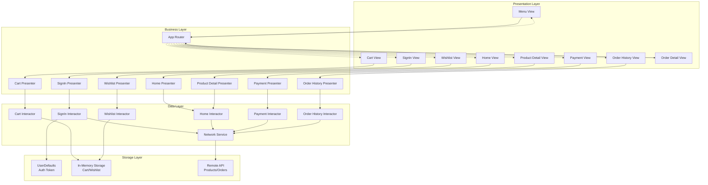

### **Data Flow Diagram (DFD) - Level 0 (Context Diagram)**

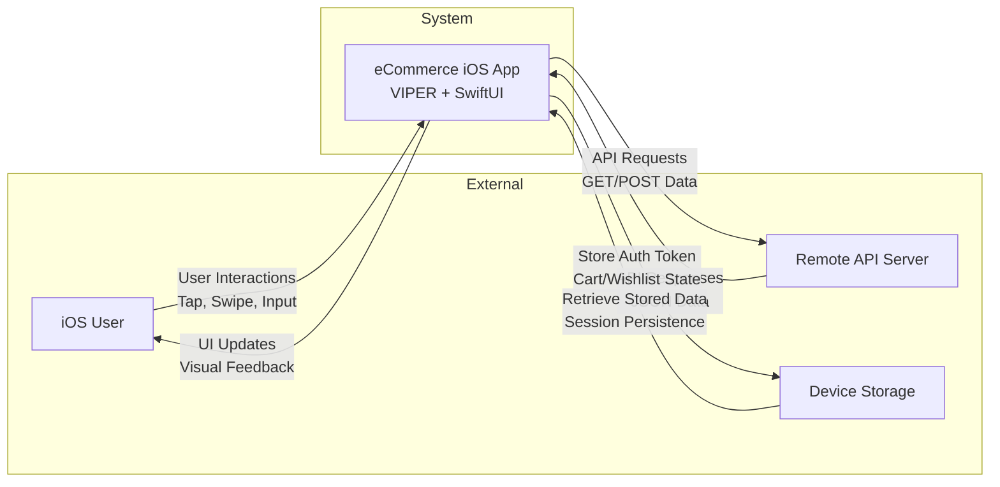

### **Data Flow Diagram (DFD) - Level 1 (System Overview)**

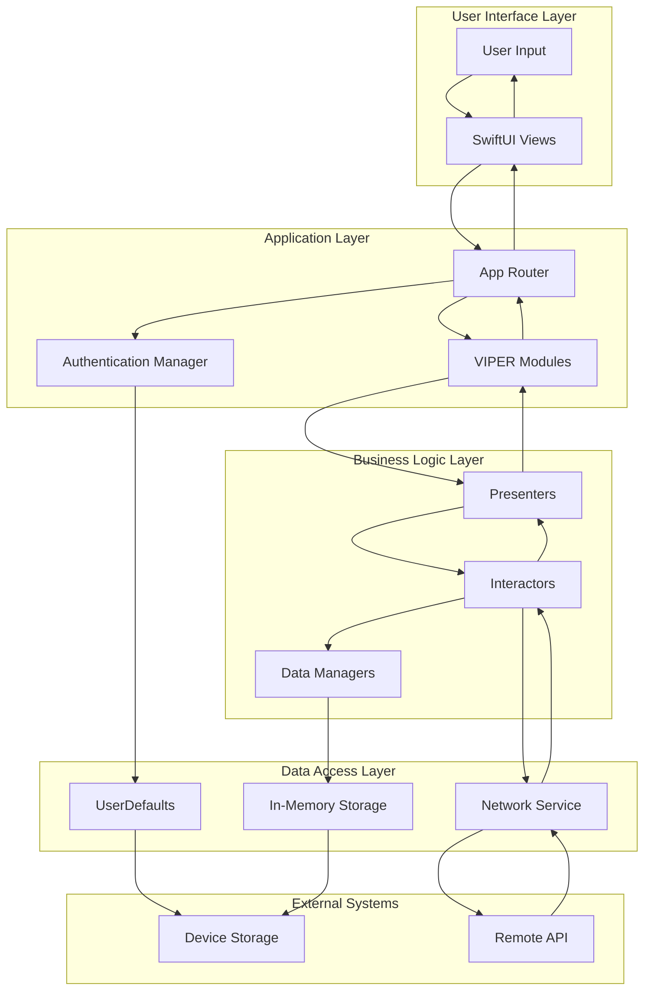

### **Detailed Module Data Flows**

#### **1. Authentication Flow**

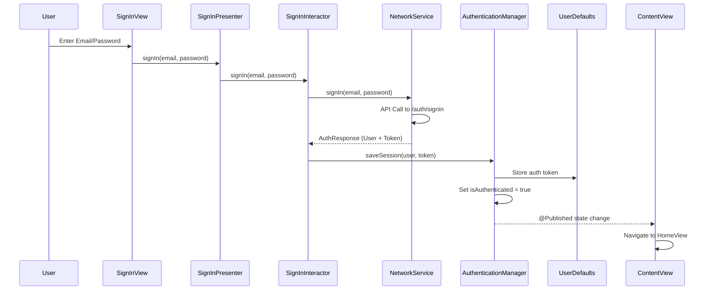

#### **2. Product Browsing Flow**

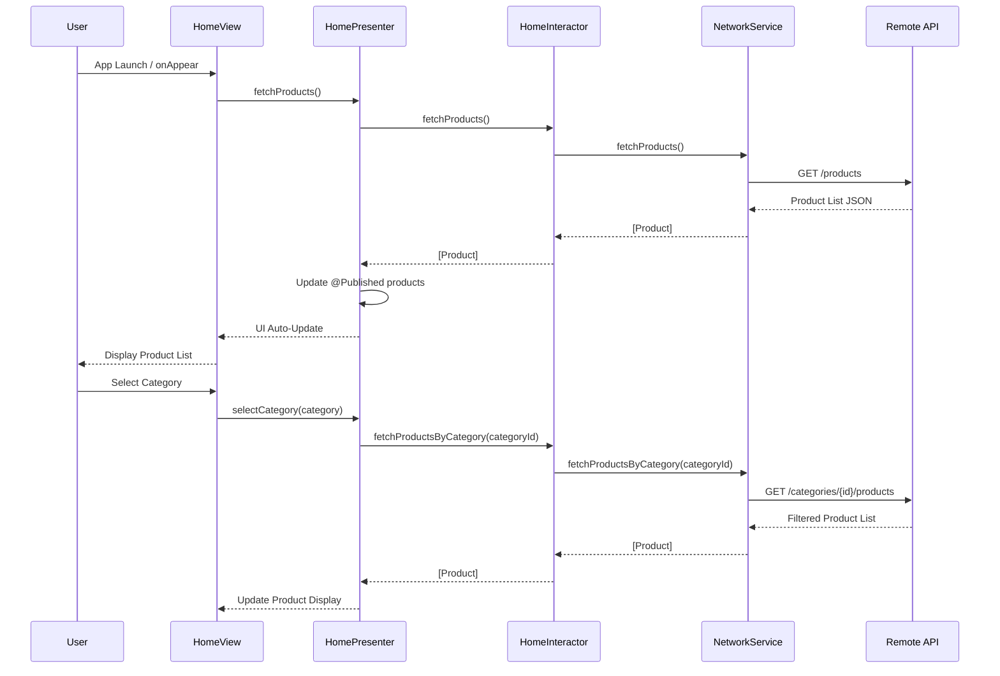

#### **3. Shopping Cart Flow**

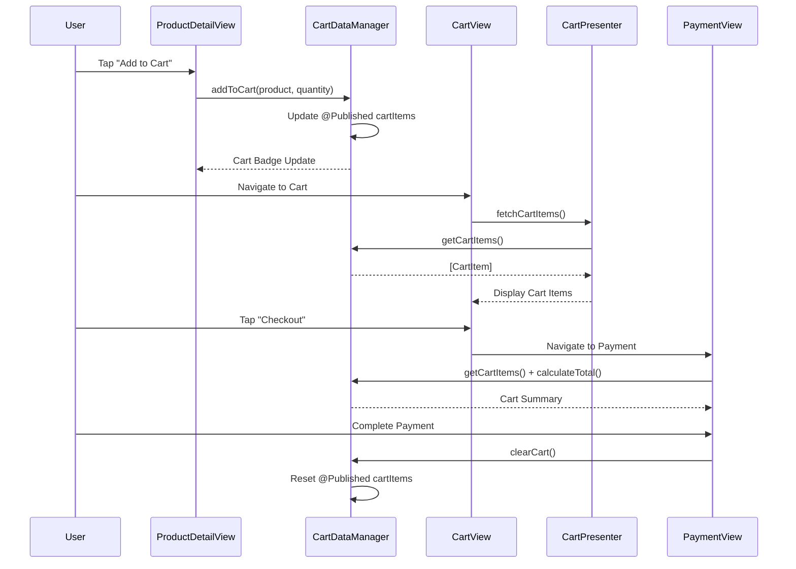

#### **4. Order Management Flow**

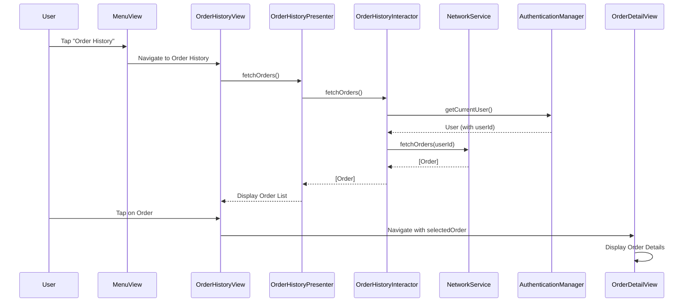

### **API Endpoints & Data Models**

#### **RESTful API Structure**

| **Category** | **Method** | **Endpoint** | **Request** | **Response** |
|--------------|------------|--------------|-------------|--------------|
| **Authentication** | POST | `/auth/signin` | `AuthRequest` | `AuthResponse` |
| | POST | `/auth/register` | `RegisterRequest` | `AuthResponse` |
| | POST | `/auth/refresh` | `RefreshToken` | `AuthResponse` |
| **Products** | GET | `/products` | - | `[Product]` |
| | GET | `/products/{id}` | - | `Product` |
| | GET | `/products/search?q={query}` | - | `[Product]` |
| **Categories** | GET | `/categories` | - | `[Category]` |
| | GET | `/categories/{id}/products` | - | `[Product]` |
| **Orders** | GET | `/orders/{userId}` | - | `[Order]` |
| | GET | `/orders/{orderId}` | - | `Order` |
| | POST | `/orders` | `CreateOrderRequest` | `Order` |

#### **Core Data Models**

<details>
<summary><strong>📋 Click to expand Data Model Definitions</strong></summary>

```swift
// MARK: - User Models
struct User: Codable {
    let id: String
    let name: String
    let email: String
}

struct AuthRequest: Codable {
    let email: String
    let password: String
}

struct AuthResponse: Codable {
    let user: User
    let token: String
    let refreshToken: String?
    let expiresIn: Int
}

// MARK: - Product Models
struct Product: Identifiable, Codable {
    let id: String
    let title: String
    let description: String
    let price: Double
    let imageURL: String
    let category: String
    let rating: Double
    let stock: Int
    let brand: String
}

struct Category: Identifiable, Codable {
    let id: String
    let name: String
    let imageURL: String?
    let productCount: Int
}

// MARK: - Cart & Wishlist Models
struct CartItem: Identifiable, Codable {
    let id: String
    let product: Product
    var quantity: Int
    let dateAdded: Date
}

struct WishlistItem: Identifiable, Codable {
    let id: String
    let product: Product
    let dateAdded: Date
}

// MARK: - Order Models
struct Order: Identifiable, Codable {
    let id: String
    let userId: String
    let items: [OrderItem]
    let totalAmount: Double
    let status: OrderStatus
    let orderDate: Date
    let deliveryDate: Date?
    let shippingAddress: String
}

struct OrderItem: Identifiable, Codable {
    let id: String
    let productId: String
    let productTitle: String
    let productImageURL: String
    let quantity: Int
    let unitPrice: Double
    let totalPrice: Double
}

enum OrderStatus: String, Codable, CaseIterable {
    case pending = "pending"
    case confirmed = "confirmed"
    case processing = "processing"
    case shipped = "shipped"
    case delivered = "delivered"
    case cancelled = "cancelled"
}
```

</details>

### **State Management Strategy**

#### **Global State Managers**

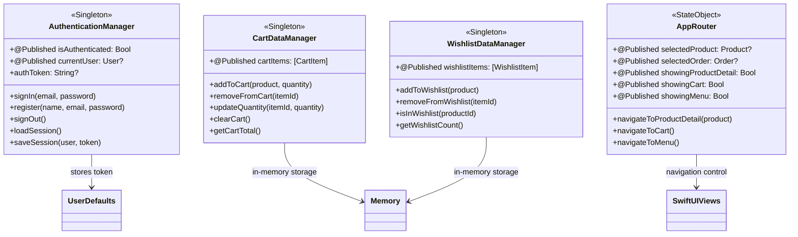

### **Security & Data Protection**

#### **Security Architecture**

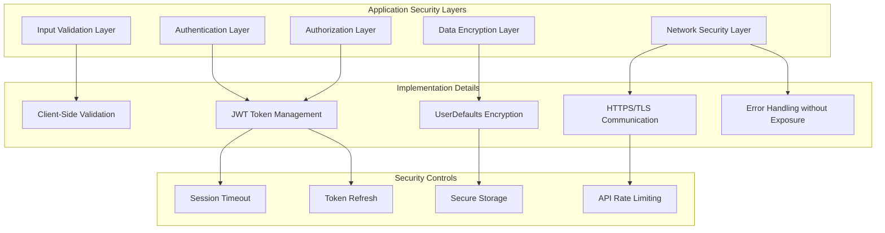

#### **Data Protection Measures**

| **Security Layer** | **Implementation** | **Purpose** |
|-------------------|-------------------|-------------|
| **Authentication** | JWT Token + UserDefaults | Secure user session management |
| **Network** | HTTPS + TLS/SSL | Encrypted API communication |
| **Data Storage** | UserDefaults + In-Memory | Minimal persistent data exposure |
| **Input Validation** | Client-side validation | Prevent malicious input |
| **Error Handling** | Generic error messages | No sensitive data exposure |
| **Session Management** | Auto-refresh + Expiry | Prevent session hijacking |

### **Performance Optimizations**

#### **App Performance Strategy**

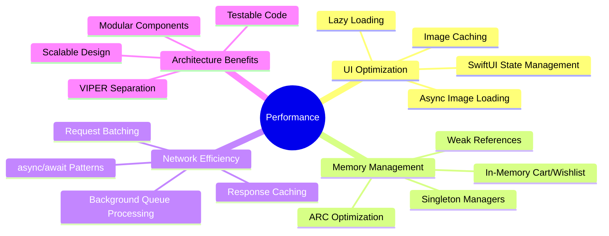

### **Complete User Journey Flow**

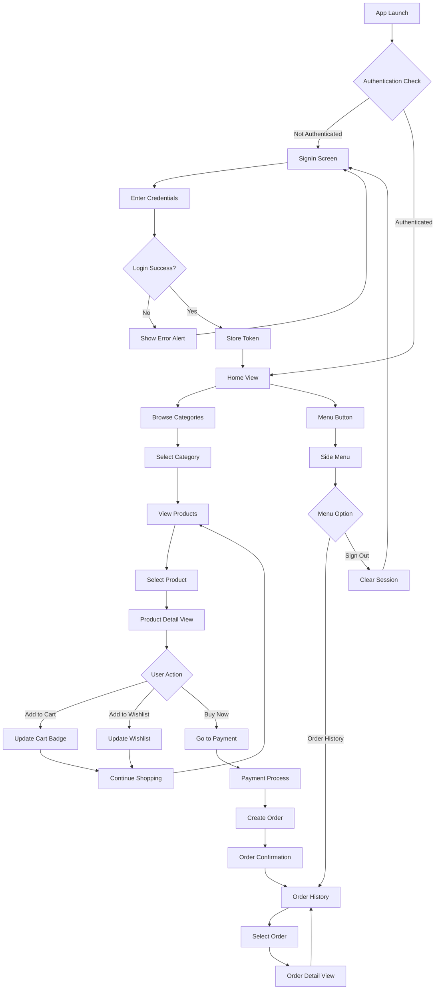

## 📊 Key Design Decisions & Benefits

### **Architecture Benefits**
1. **🏗️ VIPER Pattern**: Clean separation of concerns across all modules
2. **⚡ SwiftUI + Combine**: Modern reactive UI with real-time data binding
3. **🔄 Async/Await**: Modern Swift concurrency for network operations
4. **🧠 In-Memory State**: Optimal performance for transient data (Cart/Wishlist)
5. **🌐 API-First**: Complete server-driven architecture for scalability

### **Data Flow Principles**
1. **➡️ Unidirectional Flow**: Data flows from API → Interactor → Presenter → View
2. **🔄 Reactive Updates**: `@Published` properties ensure real-time UI updates
3. **🎯 Centralized Navigation**: AppRouter manages all screen transitions
4. **💾 Session Persistence**: UserDefaults for authentication state
5. **⚠️ Error Propagation**: Comprehensive error handling at all layers

### **Performance Benefits**
1. **⚡ Lazy Loading**: Views load data on-demand for optimal performance
2. **🖼️ Image Caching**: AsyncImage with automatic caching mechanisms
3. **🧠 Memory Management**: In-memory data for frequently accessed items
4. **🎯 API Efficiency**: Targeted endpoints for specific data requirements
5. **📱 Responsive UI**: Adaptive layout for all iPhone screen sizes

---

*This comprehensive technical documentation provides a complete reference for the iOS eCommerce application's architecture, data flow, and implementation details. The design emphasizes modularity, maintainability, and scalability while following modern iOS development best practices.*